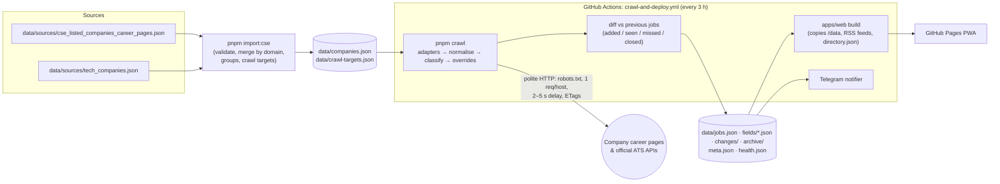

# Rekiya — Sri Lanka jobs from company career pages

> Let us do the searching. You do the applying.

Rekiya collects open vacancies from the official career pages of Sri Lankan companies (every CSE-listed company
plus leading tech employers), classifies them by field, industry and seniority, and shows them in an installable
web app. Applications always happen on the company's own listing.

**Live site:** https://vacancyfinder.github.io/

- Static site on **GitHub Pages**; all background work runs in **GitHub Actions** (zero recurring cost).
- Jobs sync every 3 hours: crawl → classify → diff → commit data (only if it changed) → build → deploy. The open
  website picks up each new sync by itself (see [Job sync](#job-sync-every-3-hours)).
- Per-field **RSS feeds** at `/feeds/<field>.xml`, optional **Telegram** channel alerts.
- For job seekers: search with filters, sorting and quick filters; a page per job with similar jobs; an application tracker
  with notes and CSV export; saved searches with new-match counts; hide jobs or companies; market insights; dark mode;
  offline support. No accounts — everything personal stays in the browser. Full list: [docs/FEATURES.md](docs/FEATURES.md).
- **SEO & AI search:** clean URLs, a prerendered HTML page for every job, field and company, Google for Jobs
  (`JobPosting`) structured data, sitemap, `llms.txt` for AI assistants and IndexNow pings after each crawl.
  Owner setup (Search Console, Bing, custom domain): [docs/SEO.md](docs/SEO.md).
  Sharing, WhatsApp previews and ready-made introduction messages: [docs/SHARE.md](docs/SHARE.md).

## Architecture



| Path                            | What it is                                                                                                                                 |
| ------------------------------- | ------------------------------------------------------------------------------------------------------------------------------------------ |
| `packages/shared`               | zod schemas + types shared by crawler and web (`@rekiya/shared/constants` is zod-free for the browser)                                     |
| `packages/crawler/src/import`   | `pnpm import:cse` — builds `companies.json`, `groups.json`, `crawl-targets.json` from the source lists                                     |
| `packages/crawler/src/discover` | `pnpm discover` — finds careers-page candidates for companies with only a website                                                          |
| `packages/crawler/src/adapters` | one file per source type: `ats.ts` (Lever, Greenhouse, Workable, SmartRecruiters, Teamtailor, Workday), `jsonld.ts`, `html.ts`, `custom/*` |
| `packages/crawler/src/classify` | `seniority.ts`, `fields.ts`, `taxonomy.json` (editable keyword weights), text/location normalisation                                       |
| `packages/crawler/src/pipeline` | `run.ts` (crawl), `normalize.ts`, `diff.ts`, `write.ts`, `validate.ts`                                                                     |
| `packages/crawler/fixtures`     | saved real pages / API responses used by the adapter tests                                                                                 |
| `apps/web`                      | Vite + React + Tailwind PWA (HashRouter, MiniSearch)                                                                                       |
| `data/`                         | curated + generated JSON, committed                                                                                                        |
| `.github/workflows`             | `ci.yml`, `crawl-and-deploy.yml`, `company-request.yml`, `probe.yml`                                                                       |

## Job sync (every 3 hours)

Everything runs in `.github/workflows/crawl-and-deploy.yml` on GitHub's servers — nothing needs to stay on.

- **Schedule (self-sustaining).** GitHub's cron is best-effort: it starts runs late and on busy days drops most of
  them (an hourly cron here produced 8 runs in 3 days, leaving 7-hour-old data). So every sync ends by starting
  `.github/workflows/sync-timer.yml`, which waits until the next sync is due and starts it — each sync schedules the
  next. A cron check twice an hour is the backup: it crawls only when a sync is overdue and restarts the timer if the
  chain ever breaks. The gate's log line says why a run did or didn't crawl.
- **Each sync:** crawl every company careers page (one automatic retry) → validate → commit `data/` when jobs
  changed → Telegram alert (optional) → build and prerender the site → deploy to GitHub Pages → check the live site
  is serving the new build (redeploy if not) → notify Bing & co. via IndexNow.
- **When something fails:** a failed or invalid crawl never reaches the site — the previous data is restored and
  redeployed, the run is marked failed, and a retry runs 45 minutes later. Deploys wait and retry while another Pages
  deployment is in progress. Details: [docs/OPERATIONS.md](docs/OPERATIONS.md).
- **Status page:** `/status/` shows anyone whether the website, job data, automatic sync, career pages and publishing
  are healthy, with the recent sync history (linked from every page's footer).
- **The website updates itself.** An open tab checks for a newer sync every 5 minutes and when it's brought back to
  the front, then swaps in the new jobs with a "Jobs updated" notice — no reload. Pages show when the next sync is due.
- **Sync now:** Actions → Crawl and deploy → Run workflow, or `pnpm sync:remote` (`scripts/trigger-sync.sh`, needs
  the GitHub CLI or a `GITHUB_TOKEN`). Pass target ids to crawl only some sites: `scripts/trigger-sync.sh wso2,dialog`.
- **Sync locally** (no deploy): `pnpm sync` — crawl, validate and build into `apps/web/dist`.
- **Change the interval:** `SYNC_MINUTES` in `crawl-and-deploy.yml`, and `SYNC_EVERY_MS` in `apps/web/src/lib/data.tsx`
  for the "next update" label and the status page.

## Setup

Node 20+ and pnpm 9 (`corepack enable`).

```sh
pnpm install
pnpm typecheck && pnpm lint && pnpm test   # all checks CI runs
pnpm import:cse                            # regenerate companies/groups/crawl-targets from data/sources
pnpm crawl                                 # crawl every ready company (needs internet; ~10 min politely)
pnpm crawl --only wso2-com-careers         # crawl specific targets
pnpm validate:data                         # validate /data against the schemas
pnpm --filter @rekiya/web dev              # web app at http://localhost:5173 (serves /data)
pnpm build && pnpm --filter @rekiya/web e2e  # production build + Playwright smoke tests (axe WCAG checks)
```

### One-time GitHub settings

1. **Settings → Pages → Source: GitHub Actions** (the deploy job uses `actions/deploy-pages`).
2. **Settings → Actions → General → Workflow permissions:** allow "Read and write" and "Allow GitHub Actions to
   create and approve pull requests" (the crawl commits data; the company-request flow opens draft PRs).
3. Optional alerts: add repository secrets `TELEGRAM_BOT_TOKEN` and `TELEGRAM_CHAT_ID`. Without them the alert step
   is skipped.

## How a company gets crawled

A company is crawled only when its entry in `data/companies.json` has `status: "ready"` (a careers URL **and** an
adapter other than `none`) and `active: true`. Companies sharing one careers page (e.g. John Keells, Hayleys) form
one crawl target, fetched once per run; its jobs belong to the parent group unless a listing names one subsidiary.

### Add a company

- **Anyone:** open the [Suggest a company](../../issues/new?template=suggest-company.yml) issue form. The
  `company-request` workflow opens a draft PR adding it with `active: false`.
- **Maintainer:** review that PR (or edit `data/companies.json` directly):
  1. confirm the careers page is the company's own (or its official ATS) and that robots.txt and the site's terms
     allow crawling;
  2. choose an adapter (below) and fill `adapterConfig`;
  3. set `active: true`, run `pnpm import:cse` (regenerates crawl targets) and `pnpm crawl --only <target-id>`;
  4. save the page as a fixture in `packages/crawler/fixtures/` and add a case to `test/adapters.test.ts`.

`adapter`, `adapterConfig`, `notes` and `active` are never overwritten by `pnpm import:cse`.

### Choose an adapter (in this order)

| Adapter                                                                | When                                  | `adapterConfig`                                                                                             |
| ---------------------------------------------------------------------- | ------------------------------------- | ----------------------------------------------------------------------------------------------------------- |
| `lever` / `greenhouse` / `workable` / `smartrecruiters` / `teamtailor` | the company uses that ATS             | `{ "site" }` / `{ "board" }` / `{ "account" }` / `{ "company" }` / `{ "subdomain" }` or `{ "feedUrl" }`     |
| `custom` + `kind: "workday"`                                           | a Workday career site                 | `{ "kind": "workday", "host", "tenant", "site", "appliedFacets" }`                                          |
| `jsonld`                                                               | the page has `JobPosting` JSON-LD     | `{ "detailLinkPattern"?: "regex" }` to follow listing links                                                 |
| `html`                                                                 | plain HTML list                       | `{ "listSelector", "titleSelector", "linkSelector", "locationSelector", ... }` — see `src/adapters/html.ts` |
| `custom` + `kind`                                                      | anything else (a site's own JSON API) | one file in `src/adapters/custom/`                                                                          |

Every adapter accepts `"locationFilter": "sri lanka|colombo"` to keep only Sri Lankan roles from a global account,
`"url"` to fetch a different page than `careersUrl`, and `"attributeTo": [{ "company": "slug", "pattern": "regex" }]`
to credit listings to a company that has no page of its own (e.g. Octave on the John Keells page).

If a site can't be crawled reliably or ethically, leave it `active: false` with a `notes` line saying why.

### Fix a misclassification

- **Many jobs wrong:** edit `packages/crawler/src/classify/taxonomy.json` (title hits weigh 3, description hits 1,
  a field needs ≥ 3; prefix a term with `title:` if it's too generic in descriptions) and add the title to
  `test/classify.test.ts`.
- **One job wrong:** add to `data/overrides.json` — applied after classification on every run:

```json
{
  "jobs": { "<job id>": { "fields": ["data-ai-ml"], "seniority": "senior" } },
  "titlePatterns": [{ "match": "\\bSAP\\b", "set": { "fields": ["software-engineering"] } }]
}
```

## Data files (`/data`)

| File                        | Purpose                                                                                   |
| --------------------------- | ----------------------------------------------------------------------------------------- |
| `companies.json`            | curated registry (see above)                                                              |
| `crawl-targets.json`        | generated: one entry per unique careers page                                              |
| `jobs.json`                 | open jobs, plus jobs closed in the last 30 days (kept to reopen/archive them)             |
| `fields/<field>.json`       | open jobs per field — the web app loads only the fields a user follows                    |
| `changes/YYYY-MM-DD.json`   | jobs added/closed by each run that day                                                    |
| `archive/YYYY-MM.json`      | jobs closed more than 30 days ago                                                         |
| `meta.json`                 | `generatedAt`, counts per field/company/seniority/industry, run duration                  |
| `health.json`               | per crawl target: last success, last error, consecutive failures, job count, suspect flag |
| `overrides.json`            | manual fixes                                                                              |
| `discovery-candidates.json` | output of `pnpm discover` for review — never crawled until copied into `companies.json`   |

Update rules per run: a job seen for the first time is **added**; seen again → `lastSeenAt` refreshed; missing from
a successful crawl → `missedRuns++`, and **closed** at 2. A failed crawl never touches a company's jobs, and a company
that had ≥ 3 jobs but suddenly returns 0 is flagged `suspect` and kept as it was.

## Legal and ethics

- Rekiya reads **public** career pages and **official public ATS APIs** only. It does not scrape third-party job
  boards (topjobs.lk, LinkedIn, rooster.jobs boards, …); companies that post only there are listed as "coming soon".
- It honours **robots.txt** (RFC 9309; an unreachable robots.txt counts as "disallow"), sends one request at a time
  per host with a 2–5 s randomised pause, identifies itself as `RekiyaBot/1.0 (+repo URL)`, uses conditional
  requests, and times out after 20 s with at most 2 retries.
- It stores only a job's title, location, dates and a **snippet of at most 300 characters** — never full
  descriptions — and always links to the original listing. It never collects or forwards applications.
- Company names are shown as text/initials badges; logos are not used (opt-in `logo` field only).
- A company that wants to be removed can open an issue; set `active: false` and its jobs close on the next run.
